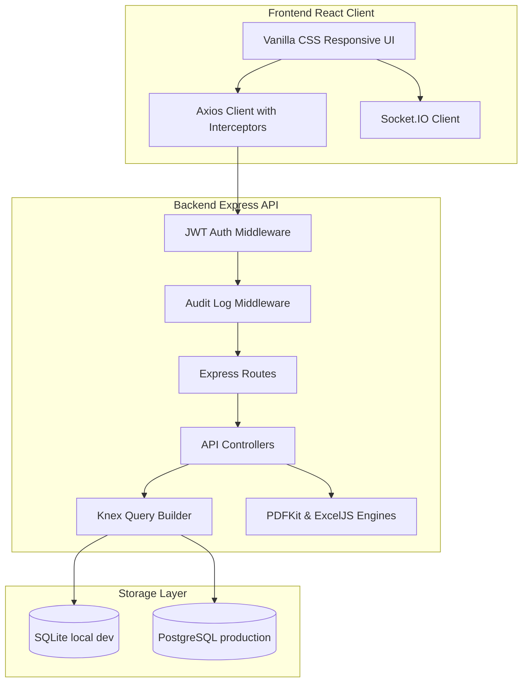
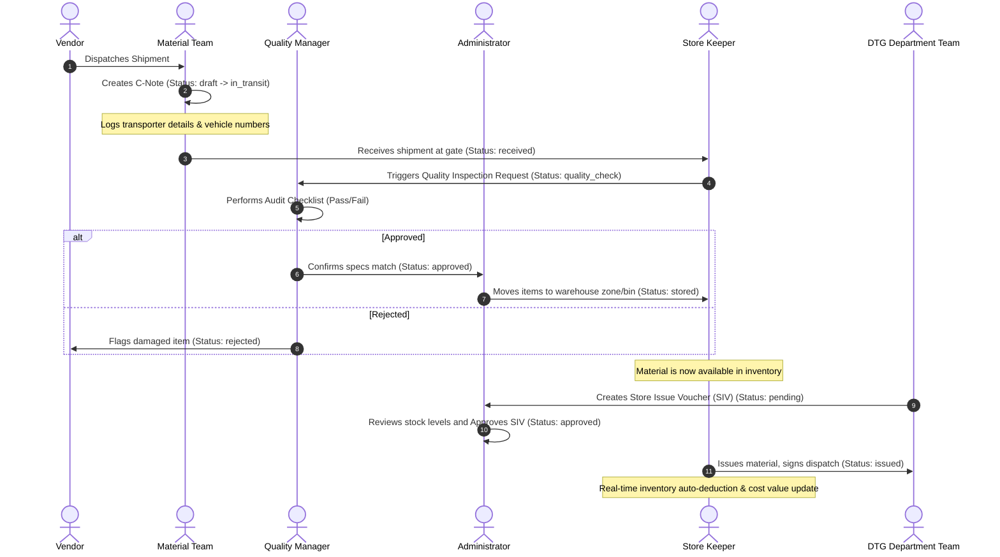

# Smart Material & Inventory Management Platform (SMIMP)

[](https://nodejs.org/)
[](https://react.dev/)
[](https://knexjs.org/)
[](https://socket.io/)
[](LICENSE)

SMIMP is an enterprise-grade, real-time Material Lifecycle and Inventory Management Platform designed for complex industrial environments. The system handles end-to-end logistics, beginning from consignment tracking (C-Notes), continuing to quality inspections, warehouse inventory management, and concluding with departmental material issuance (SIVs).

---

## 🏗️ System Architecture

SMIMP utilizes a decoupled Client-Server architecture utilizing a RESTful API and WebSocket events for real-time dashboard state synchronization.



---

## ⚡ Workflow Sequence

The platform streamlines material logistics across departments through a structured stage-based lifecycle.



---

## ✨ Features

### 📦 Material & Inventory Management
*   **Dynamic Attributes:** Log materials with SKUs, units, categorization, and cost variables.
*   **Threshold Warnings:** Visual indicators flag low stock based on minimum threshold settings.
*   **Asset Valuation:** Real-time auto-calculation of total holding stock value.
*   **Transaction Audits:** Deep historical trail of transactions (`stock_in`, `stock_out`, `transfer`, `adjustment`, `return`, `disposal`).

### 🚚 Consignment Notes (C-Note Module)
*   **Shipment Tracking:** Track materials received from vendors and verify transit states.
*   **Transportation Log:** Store vehicle registration numbers, transporter names, dispatch timelines, and gate arrival dates.
*   **PO Integration:** Correlate consignment payloads to existing Purchase Orders.

### 📝 Store Issue Vouchers (SIV Module)
*   **Departmental Requisitions:** Track materials distributed from central inventory to departments.
*   **Real-time Stock Deductions:** Deducts stock metrics and re-calculates assets automatically on issuance.
*   **Strict Access Control:** Requires separate creation (DTG Team), approval (Admin), and issuance (Store Keeper) actions.

### 📊 Analytics & Reporting Engine
*   **Live Dashboard:** Real-time KPIs with Socket.IO updates, Recharts graphs for quarterly transaction volumes, and category distribution charts.
*   **Multiformat Export:** Download PDF documents (using customized layout grids in PDFKit), Excel Spreadsheets (with styled cells and custom calculations via ExcelJS), and CSVs for all modules:
    *   *Materials Inventory Report*
    *   *Inventory Transaction Log Report*
    *   *Quality Inspection Status Report*
    *   *Consignment Shipment Tracking Report*
    *   *Store Issue Voucher Audit Report*
    *   *System Security Audit Log Report*

### 🔒 Enterprise-Grade Security
*   **Stateless Authentication:** Secure JWT setup with automatic background token refreshes.
*   **Role-Based Access Control (RBAC):** Restricts interface access according to organizational roles (Super Admin, Org Admin, Inventory Manager, Quality Manager, Warehouse Manager, Store Keeper, Material Team, DTG Team, Viewer).
*   **Comprehensive Audit Trail:** Logs all modifications (`CREATE`, `UPDATE`, `DELETE`) detailing target entity, action author, timestamp, and pre/post values comparison.

---

## 🛠️ Tech Stack

| Layer | Technology | Key Libraries |
|---|---|---|
| **Frontend** | React (v19.x), Vite, Vanilla CSS | Recharts, HTML5-QRCode, Axios, React Hot Toast, React Router |
| **Backend** | Node.js, Express | Socket.IO, Knex.js, PDFKit, ExcelJS, bcryptjs, jsonwebtoken |
| **Database** | SQLite, PostgreSQL | better-sqlite3, pg |

---

## 🚀 Installation & Local Setup

### Prerequisites
*   Node.js (v18 or higher recommended)
*   npm (v9 or higher)

### 1. Database & Backend Configuration
1.  Navigate into the `server` directory:
    ```bash
    cd server
    ```
2.  Install dependencies:
    ```bash
    npm install
    ```
3.  Set up your environment variables. Copy the template:
    ```bash
    cp .env.example .env
    ```
    *By default, the backend configures an SQLite database named `smimp.db` at the server root. No external database configurations are required for local development.*
4.  Launch the backend server:
    ```bash
    npm run dev
    ```
    *On startup, the platform will automatically run all migrations and insert seeded default database objects.*

### 2. Frontend Configuration
1.  Open a new terminal window and navigate to the `client` directory:
    ```bash
    cd client
    ```
2.  Install dependencies:
    ```bash
    npm install
    ```
3.  Launch the development server:
    ```bash
    npm run dev
    ```
4.  Access the interface at [http://localhost:5173](http://localhost:5173).

---

## 🔑 Default Credentials

All local accounts are pre-seeded with the default password: **`Admin@123`**

| User Profile | Email | Department |
|---|---|---|
| **Super Admin** | `superadmin@smimp.com` | IT |
| **Org Admin** | `admin@bhel.in` | Administration |
| **Inventory Manager** | `inventory@bhel.in` | Stores |
| **Material Team** | `material@bhel.in` | Material Management |
| **DTG Team** | `dtg@bhel.in` | DTG |
| **Quality Manager** | `quality@bhel.in` | Quality Control |
| **Warehouse Manager** | `warehouse@bhel.in` | Warehouse |
| **Store Keeper** | `storekeeper@bhel.in` | Stores |
| **Viewer (Read-Only)** | `viewer@bhel.in` | Finance |

---

## 📸 Screenshots Section

*Add screenshots here once deployed or local server is captured.*

<p align="center">
  
</p>

---

## 🔮 Future Enhancements

*   **Predictive Stock Reordering:** Machine-learning integrations to predict upcoming material requirements based on historical issue cycles.
*   **RFID Integration:** Add passive RFID scanner APIs for automated warehouse bin checking.
*   **Offline Mode:** Offline capabilities for mobile QR scanning in zones with limited network access.
*   **SSO Authentication:** Integrate SAML/OIDC and OAuth 2.0 protocols for Enterprise Single Sign-On.

---

## 🤝 Contributors

Contributions, issues, and feature requests are welcome! Feel free to check the issues page.

*   **SMIMP Engineering Team** - Lead developer and maintainers.

---

## 📄 License

Distributed under the MIT License. See [LICENSE](LICENSE) for more information.
